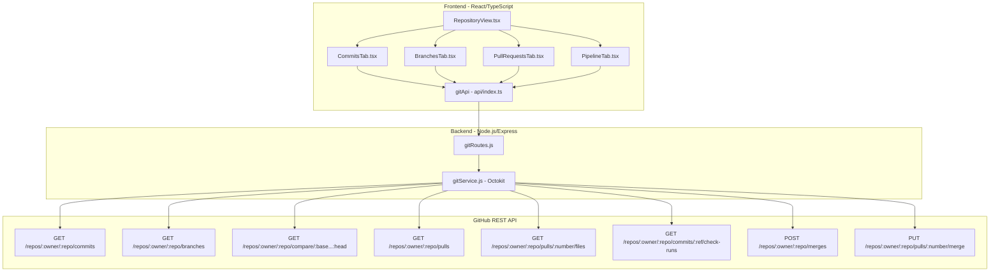

# Design Document: Repository Management UI

## Overview

This feature replaces the basic `RepoActivity` commit list with a full-featured, tabbed repository management UI embedded in the project detail page. The design extends the existing `gitService.js` / `gitRoutes.js` backend layer with seven new endpoints and replaces `RepoActivity.tsx` with a set of focused tab-panel components, all wired through a typed `gitApi` client module.

The GitHub REST API is accessed exclusively via Octokit on the backend. The frontend never calls GitHub directly — all calls go through the Express proxy at `/api/git/...`, which handles authentication via `process.env.GITHUB_TOKEN`.

**Token scope note:** Read operations (commits, branches, PRs, pipeline) require `public_repo` or `repo` scope. Merge operations require `repo` scope with write access (push permission on the target repository). This must be documented in the UI and in `gitService.js`.

---

## Architecture



---

## Components and Interfaces

### Frontend Components

#### `RepositoryView.tsx` (modified)

The existing gate component is extended to render a `<Tabs>` container (Radix UI via shadcn/ui) when a repository is linked. The four tab values are `commits`, `branches`, `pulls`, `pipeline`.

```
RepositoryView
├── (no repo) → link prompt + LinkRepoModal [unchanged]
└── (repo linked)
    ├── Token scope info banner
    └── Tabs
        ├── CommitsTab
        ├── BranchesTab
        ├── PullRequestsTab
        └── PipelineTab
```

Props remain: `projectId`, `owner?`, `repo?`, `onRefresh`.

#### `CommitsTab.tsx` (new)

Fetches commits on mount. Groups them by date using a pure `groupCommitsByDate` utility function. Renders date headers and commit rows. Supports "Load more" pagination.

#### `BranchesTab.tsx` (new)

Fetches all branches on mount. Renders each branch with ahead/behind counts. Triggers merge via `gitApi.mergeBranch`. Handles 409 conflict inline.

#### `PullRequestsTab.tsx` (new)

Fetches open PRs on mount. Renders a PR list. On PR selection, fetches file diffs and renders an expandable file-by-file diff viewer with a `DiffViewer` sub-component.

#### `PipelineTab.tsx` (new)

Fetches check runs for the default branch's latest commit. Renders each step with a status icon. Computes and displays the overall summary badge using a pure `computePipelineSummary` utility function.

#### `DiffViewer.tsx` (new)

A pure rendering component that takes a raw `patch` string and renders it line-by-line with green/red highlighting for additions/removals. Displays "prev" and "current" column headers.

### Backend Modules

#### `gitService.js` (extended)

All new functions are added alongside the existing `getRepoActivity`. Each function uses the shared `octokit` instance.

```
getRepoActivity(owner, repo)          [existing]
getCommits(owner, repo, page)         [new]
getBranches(owner, repo)              [new]
getPulls(owner, repo)                 [new]
getPullFiles(owner, repo, pullNumber) [new]
getPipeline(owner, repo)              [new]
mergeBranches(owner, repo, head, base, message) [new]
mergePull(owner, repo, pullNumber, message)     [new]
```

#### `gitRoutes.js` (extended)

New routes added to the existing router. The existing `GET /:owner/:repo` route is preserved for backward compatibility.

---

## Data Models

### TypeScript Interfaces (frontend)

```typescript
// frontend/src/api/git.types.ts (new file, imported by index.ts)

export interface GitCommit {
  sha: string;
  message: string;
  author: {
    name: string;
    avatarUrl: string;
    date: string; // ISO 8601
  };
  stats: {
    additions: number;
    deletions: number;
  };
  refs: string[]; // branch/tag names pointing to this SHA
}

export interface GitBranch {
  name: string;
  isDefault: boolean;
  ahead: number;
  behind: number;
  lastCommitSha: string;
}

export interface GitPullRequest {
  number: number;
  title: string;
  author: {
    login: string;
    avatarUrl: string;
  };
  headBranch: string;
  baseBranch: string;
  createdAt: string; // ISO 8601
  state: 'open' | 'closed' | 'merged';
}

export interface GitPullFile {
  filename: string;
  status: 'added' | 'removed' | 'modified' | 'renamed';
  additions: number;
  deletions: number;
  patch: string; // raw unified diff patch
}

export interface GitCheckRun {
  id: number;
  name: string;
  status: 'queued' | 'in_progress' | 'completed';
  conclusion: 'success' | 'failure' | 'neutral' | 'skipped' | 'cancelled' | null;
}

export interface MergeResult {
  merged: boolean;
  message: string;
  sha?: string;
}

export type PipelineSummary = 'passing' | 'failing' | 'running' | 'unknown';
```

### Backend Response Shapes

The backend normalizes GitHub API responses into the shapes above before returning them. This decouples the frontend from GitHub's raw API format and makes the shapes stable.

**Commits endpoint normalization:**
- `sha` → `commit.sha`
- `message` → `commit.commit.message`
- `author.name` → `commit.commit.author.name`
- `author.avatarUrl` → `commit.author?.avatar_url`
- `author.date` → `commit.commit.author.date`
- `stats.additions` / `stats.deletions` → from `commit.stats` (requires individual commit fetch or `GET /commits` with `per_page` — note: list endpoint does not include stats; individual `GET /repos/:owner/:repo/commits/:sha` is needed per commit, or use the `GET /repos/:owner/:repo/commits` with `?per_page` which returns stats in the response when fetching individual commits)

> **Design decision:** To get per-commit stats without N+1 requests, the backend fetches the commit list and then fetches stats for each commit in parallel using `Promise.all`. This is acceptable for page sizes of 30. A future optimization could cache stats.

**Branches endpoint normalization:**
- Fetches branch list via `octokit.rest.repos.listBranches`
- Fetches default branch name from `octokit.rest.repos.get`
- For each non-default branch, calls `octokit.rest.repos.compareCommitsWithBasehead` to get `ahead_by` and `behind_by`
- Default branch has `ahead: 0, behind: 0`

---

## Correctness Properties

*A property is a characteristic or behavior that should hold true across all valid executions of a system — essentially, a formal statement about what the system should do. Properties serve as the bridge between human-readable specifications and machine-verifiable correctness guarantees.*

### Property 1: Commit grouping partitions all commits by date

*For any* array of commit objects with arbitrary dates, the `groupCommitsByDate` function SHALL produce a grouping where every commit appears in exactly one group, the group key matches the commit's calendar date (YYYY-MM-DD), and the union of all groups equals the original array.

**Validates: Requirements 2.2**

---

### Property 2: Commit row rendering contains all required fields

*For any* valid `GitCommit` object, the rendered commit row SHALL contain the first 7 characters of the SHA, the full commit message, the author name, and the `+additions` / `-deletions` stats with correct numeric values.

**Validates: Requirements 2.3, 2.4, 2.5**

---

### Property 3: Branch row rendering correctly reflects default/non-default status

*For any* array of `GitBranch` objects, the rendered branch list SHALL display exactly one "default" badge (on the branch where `isDefault === true`), and every branch where `isDefault === false` SHALL have a "Merge into default" button, while the default branch SHALL NOT have a merge button.

**Validates: Requirements 3.2, 3.3, 3.4**

---

### Property 4: Pull request row rendering contains all required fields

*For any* valid `GitPullRequest` object, the rendered PR row SHALL contain the PR number, title, author login, head branch name, base branch name, and a formatted creation date.

**Validates: Requirements 4.2**

---

### Property 5: File diff list rendering contains per-file stats

*For any* array of `GitPullFile` objects, the rendered file diff list SHALL display each filename, the additions count, and the deletions count for every file in the array, with no files omitted.

**Validates: Requirements 4.4**

---

### Property 6: Diff patch rendering preserves all lines with correct highlighting

*For any* raw unified diff patch string, the `DiffViewer` component SHALL render every line from the patch, lines starting with `+` SHALL be highlighted green, lines starting with `-` SHALL be highlighted red, and context lines (starting with ` `) SHALL have no color highlight.

**Validates: Requirements 4.5**

---

### Property 7: Pipeline summary aggregation is deterministic and correct

*For any* array of `GitCheckRun` objects, the `computePipelineSummary` function SHALL return:
- `"passing"` if and only if the array is non-empty and every run has `status === "completed"` and `conclusion === "success"`
- `"failing"` if and only if any run has `conclusion === "failure"` or `conclusion === "cancelled"`
- `"running"` if and only if any run has `status === "in_progress"` or `status === "queued"` (and no run is failing)
- `"unknown"` if the array is empty

**Validates: Requirements 5.3, 5.4, 5.5, 5.6**

---

### Property 8: Check run row rendering contains all required fields

*For any* valid `GitCheckRun` object, the rendered check run row SHALL contain the run name, a status icon corresponding to the run's status/conclusion, and a conclusion label.

**Validates: Requirements 5.2**

---

## Error Handling

### Backend

| Condition | HTTP Status | Response Body |
|---|---|---|
| `GITHUB_TOKEN` not set | 503 | `{ error: "GitHub integration is not configured. Set GITHUB_TOKEN in environment." }` |
| GitHub rate limit exceeded (403 + `X-RateLimit-Remaining: 0`) | 429 | `{ error: "GitHub API rate limit exceeded. Try again later." }` |
| Repository not found (GitHub 404) | 404 | `{ error: "Repository not found." }` |
| Merge conflict (GitHub 409) | 409 | `{ error: "Merge conflict detected. Resolve conflicts manually.", conflict: true }` |
| Any other GitHub API error | 502 | `{ error: "GitHub API error: <message>" }` |
| Invalid route parameters | 400 | `{ error: "owner and repo are required." }` |

### Frontend

- Each tab panel manages its own `loading` / `error` / `data` state independently.
- On error, the tab panel renders an inline `Alert` (shadcn/ui) with the error message. The other tabs remain functional.
- On 409 merge conflict, the `BranchesTab` and `PullRequestsTab` render an inline error badge on the affected row rather than a toast.
- On successful merge, a `sonner` toast notification is shown.
- Loading states use the existing `Skeleton` component from `frontend/src/components/common/Skeleton.tsx`.

---

## Testing Strategy

### Unit Tests

Unit tests cover pure utility functions that have no external dependencies:

- `groupCommitsByDate(commits: GitCommit[]): Record<string, GitCommit[]>` — test with empty array, single commit, multiple commits on same day, commits spanning multiple days.
- `computePipelineSummary(runs: GitCheckRun[]): PipelineSummary` — test all four outcome branches.
- `parseDiffPatch(patch: string): DiffLine[]` — test with empty patch, additions-only, deletions-only, mixed.

### Property-Based Tests

Property-based tests use **fast-check** (already compatible with the Vite/TypeScript frontend setup; install as `npm install --save-dev fast-check`).

Each property test runs a minimum of **100 iterations**.

Tag format: `// Feature: repository-management-ui, Property N: <property_text>`

- **Property 1** — `groupCommitsByDate` partitions all commits by date
- **Property 2** — Commit row rendering contains all required fields
- **Property 3** — Branch row rendering correctly reflects default/non-default status
- **Property 4** — PR row rendering contains all required fields
- **Property 5** — File diff list rendering contains per-file stats
- **Property 6** — Diff patch rendering preserves all lines with correct highlighting
- **Property 7** — `computePipelineSummary` is deterministic and correct
- **Property 8** — Check run row rendering contains all required fields

### Integration Tests

Integration tests verify the backend endpoints using a mocked Octokit instance (Jest + manual mocks):

- `GET /api/git/:owner/:repo/commits` — returns normalized commit array
- `GET /api/git/:owner/:repo/branches` — returns normalized branch array with ahead/behind
- `GET /api/git/:owner/:repo/pulls` — returns normalized PR array
- `GET /api/git/:owner/:repo/pulls/:number/files` — returns normalized file diff array
- `GET /api/git/:owner/:repo/pipeline` — returns normalized check run array
- `POST /api/git/:owner/:repo/merge` — returns merge result; returns 409 on conflict
- `POST /api/git/:owner/:repo/pulls/:number/merge` — returns merge result; returns 409 on conflict
- Missing `GITHUB_TOKEN` → 503
- GitHub rate limit error → 429
